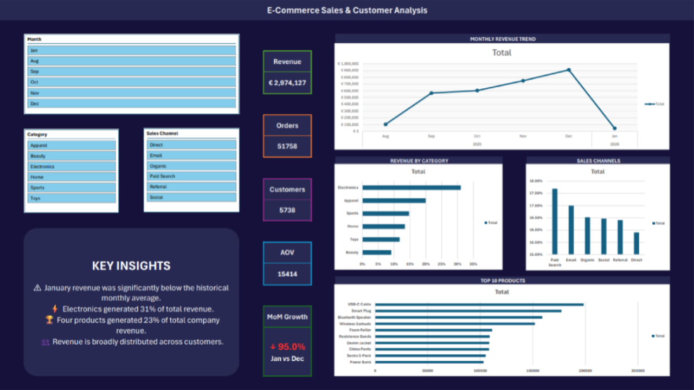

# ecommerce-excel-analysis
End-to-end e-commerce sales analysis using Excel and Power Query, including data cleaning, KPI analysis and an interactive management dashboard.
# E-Commerce Sales Performance Analysis

## Overview

An end-to-end data analysis project using **Microsoft Excel and Power Query** to investigate e-commerce sales performance and create an interactive management dashboard.

The project simulates a real-world business request: management wants to understand revenue performance, identify the products and categories driving sales, and investigate changes in monthly performance.

---

## Business Questions

The analysis focuses on five key questions:

1. Which customers are driving the most revenue?
2. Which products are performing the best?
3. How does January revenue compare with average monthly revenue?
4. How does January revenue compare with last December?
5. Which product category performs best?

---

## Tools & Skills

* Microsoft Excel
* Power Query
* PivotTables
* PivotCharts
* Data cleaning
* KPI analysis
* Data visualization
* Business analysis
* Data storytelling

---

## Data Preparation

The raw e-commerce data was cleaned and prepared using **Power Query**.

The workflow included:

* Checking for duplicate records
* Checking missing values
* Checking inconsistent categories
* Checking suspicious prices and quantities
* Correcting data types
* Reviewing unusual values
* Preparing the data for analysis

The cleaned dataset was then used as the source for the project's PivotTables and dashboard.

---

## Dashboard

The dashboard provides an interactive overview of:

* Revenue
* Orders
* Average Order Value
* Month-over-Month Growth
* Monthly revenue trends
* Category performance
* Product performance
* Sales channel performance

Users can interact with the dashboard using the available filters.

---

## Key Findings

### 1. January underperformed significantly

January revenue was significantly below the monthly average and substantially lower than December. Product performance remained broadly consistent with previous months, suggesting that the decline was not driven by a major shift in product mix. Sales-channel composition did change, with Direct Selling contributing less than its typical share while Paid Search contributed more. However, the available data does not provide enough evidence to determine a definitive cause for January's decline.

### 2. Electronics is the company's dominant category 

Electronics generated **31% of total revenue**, making it the strongest-performing product category, followed by Apparel and Sports. Electronics also maintained its position as the strongest category throughout the observed period, generating at least 30% of monthly revenue in every month analysed. 

### 3. Revenue is concentrated among a small group of products

The USB-C Cable, Smart Plug, Bluetooth Speaker and Wireless Earbuds generated **23% of total company revenue**. Each of these products also contributed at least 5% of monthly revenue throughout the observed period, indicating that a relatively small group of products within the electronics category consistently accounts for a substantial share of sales. 

### 4. Revenue is broadly distributed across customers

Revenue is broadly distributed across the customer base, with no individual customer contributing more than **0.12%** of total revenue. The three highest-revenue customers collectively accounted for only 0.34%, indicating that the business is not heavily dependent on a small number of individual customers. lio.

---

## Recommendations

Based on the available data:

### 1. Investigate January’s revenue decline

Conduct a deeper investigation into January's underperformance, particularly the change in sales-channel contribution, using additional data such as marketing spend, website traffic, inventory availability and conversion rates if available.

### 2. Protect the strongest product categories

Monitor inventory and availability of the highest-performing Electronics products, given their consistently large contribution to monthly revenue.

### 3. Reduce reliance on a small group of products

Evaluate opportunities to strengthen the performance of other products and categories to reduce reliance on the current top-performing products.

---

## Limitations

The dataset does not contain sufficient information to determine the definitive cause of January's revenue decline.
The analysis also does not include profit or margin data, limiting the ability to evaluate profitability.
Customer revenue is highly distributed, meaning customer-level concentration analysis provides limited insight into overall revenue performance.

---

## Project Structure

├── README.md
├── Ecommerce_Dashboard.xlsx
├── Ecommerce_Dashboard.pdf
├── images/
│   └── dashboard.png
└── documentation/
    ├── business_problem.md
    ├── analysis.md
    └── data_dictionary.md

---

## Author

**Ryan Donokarijo**

This project was created as part of a portfolio demonstrating practical data analysis, business problem solving and data visualization skills.
